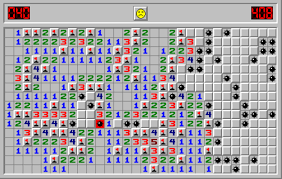
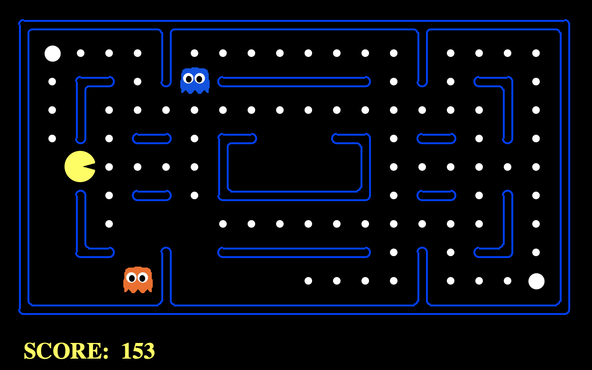

# Arcade-o-mania

## Inspiration

Arcade-o-mania is inspired by classic retro themed arcade machines seen in a gaming arena.
Now due to the pandemic its hard to go to the gaming arena and play these super cool games so I thought why not build them and make a web platform where all arcade games enthusiasts can play these super awesome fun games!

## What it does

Arcade-o-mania lets the user play a total of 6 arcade games online!

- Tetris
- Pacman
- Space invaders
- Minesweeper
- Snake
- Whac-a-mole

The user can play any of these games on this platform and the UI is inspired by the classic retro themed arcade games!

## How I built it

Arcade-o-mania is a web platform built using HTML, CSS and Javascript. It relies on javascript for all the game physics and movement of sprites or blocks.
The retro themed UI is built using HTML and CSS.
The project is javascript heavy !

